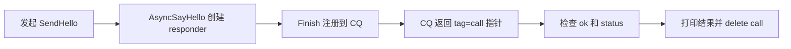
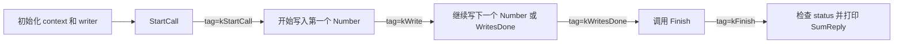
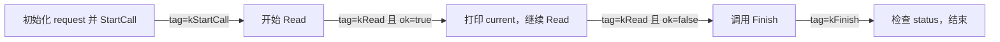
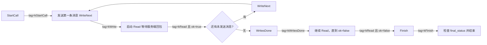

# C++ gRPC 学习项目

这个项目是一个 gRPC C++ 教学仓库，覆盖同步、异步 CQ、回调式 Reactor，以及 TLS/mTLS 的完整示例。

1. 同步 RPC
2. 客户端流式 RPC
3. 服务端流式 RPC
4. 双向流式 RPC
5. 异步 CQ 完整示例
   - 异步 unary
   - 异步 client-stream
   - 异步 server-stream
   - 异步 bidirectional-stream
6. 异步 callback API 示例（Reactor）
   - Callback unary
   - Callback client-stream
   - Callback server-stream
   - Callback bidirectional-stream
7. TLS/mTLS 安全通道示例（证书生成 + 客户端校验）

这个仓库还演示了：

- 请求元数据（`x-token`、`x-client-id`）
- 服务端 initial / trailing metadata
- 通过 context 处理 deadline 和取消
- 通道和服务端的基础配置（keepalive、消息大小）

## 文件说明

- `proto/demo.proto`：服务和消息定义
- `src/sync_server.cc`：同步服务端，支持 unary + 3 种流式 RPC
- `src/sync_client.cc`：同步客户端，调用 4 种同步 RPC
- `src/async_cq_server.cc`：异步服务端，使用 CallData 状态机实现 4 种 RPC
- `src/async_cq_client.cc`：异步客户端，使用 CQ 状态机实现 4 种 RPC
- `src/async_callback_server.cc`：回调式异步服务端，使用 Reactor API 实现 4 种 RPC
- `src/async_callback_client.cc`：回调式异步客户端，使用 Reactor API 实现 4 种 RPC
- `src/tls_server.cc`：TLS/mTLS 服务端示例
- `src/tls_client.cc`：TLS/mTLS 客户端示例，包含服务端证书校验
- `cmake/generate_certs.cmake`：用于教学的 CA / server / client 证书生成脚本

## 构建

前置要求：

- CMake >= 3.20
- Protobuf C++
- gRPC C++（通过 CMake config packages 使用）
- `grpc_cpp_plugin` 已加入 PATH
- `openssl` 已加入 PATH（用于 TLS/mTLS 证书生成）

```bash
cmake -S . -B build
cmake --build build -j
```

只生成证书：

```bash
cmake --build build --target generate_certs
```

生成后的证书会放在 `build/certs`。

## 运行 - 非加密示例

Terminal A（同步服务端）：

```bash
./build/sync_server 0.0.0.0:50051
```

Terminal B（同步客户端）：

```bash
./build/sync_client 127.0.0.1:50051
```

Terminal C（异步 CQ 服务端，4 种异步 RPC）：

```bash
./build/async_cq_server 0.0.0.0:50052
```

Terminal D（异步 CQ 客户端，4 种异步 RPC）：

```bash
./build/async_cq_client 127.0.0.1:50052
```

Terminal E（回调式异步服务端，4 种 RPC）：

```bash
./build/async_callback_server 0.0.0.0:50053
```

Terminal F（回调式异步客户端，4 种 RPC）：

```bash
./build/async_callback_client 127.0.0.1:50053
```

## 运行 - TLS/mTLS 示例

启动 TLS 服务端（仅服务器证书）：

```bash
./build/tls_server 0.0.0.0:50061 tls build/certs
```

TLS 客户端校验演示（使用 CA 验证服务器证书）：

```bash
./build/tls_client 127.0.0.1:50061 tls build/certs
```

启动 mTLS 服务端（要求并验证客户端证书）：

```bash
./build/tls_server 0.0.0.0:50062 mtls build/certs
```

mTLS 客户端演示（同时提供客户端证书并验证服务器证书）：

```bash
./build/tls_client 127.0.0.1:50062 mtls build/certs
```

## 认证元数据示例

服务端期望收到元数据头 `x-token=demo-token`。

- 缺少 `x-token`：`UNAUTHENTICATED`
- `x-token` 值错误：`PERMISSION_DENIED`
- `x-token=demo-token`：请求被接受

## 异步 CQ 状态机说明

这部分是理解 `src/async_cq_server.cc` 和 `src/async_cq_client.cc` 的关键。

- CQ 不是“业务状态”，它只是完成通知队列。
- 真正的状态机在你的代码里，由 `State` / `TagType` 和 `if` 分支控制。
- 客户端和服务端各自维护自己的状态机，二者不共享状态。
- `ok=false` 通常表示这一步异步操作失败、取消或流已结束，具体含义要结合当前状态判断。

### 1. Unary RPC：SayHello

#### 客户端状态流转



| 逻辑阶段 | tag | 含义 |
| --- | --- | --- |
| 提交请求 | `call` 指针 | 这个 tag 用来把完成事件映射回 `AsyncUnaryCall` |
| 结果完成 | `call` 指针 | CQ 告诉你 RPC 已结束，真正的成功/失败看 `status` |

客户端 unary 没有显式 `State` 枚举，流程只有“发起请求 -> 等结果”两步。

#### 服务端状态流转

```mermaid
flowchart LR
    S0[kCreate: RequestSayHello] -->|CQ 返回 tag=this| S1[校验 metadata]
    S1 -->|通过| S2[kFinish: responder.Finish(OK)]
    S1 -->|失败| S2
    S2 -->|CQ 返回 tag=this| S3[delete this]
```

| State | 异步动作 | CQ tag | 下一步 |
| --- | --- | --- | --- |
| `kCreate` | `RequestSayHello(...)` | `this` | 新请求到达后，创建下一个 `AsyncUnaryCall`，然后校验 metadata |
| `kFinish` | `responder_.Finish(...)` | `this` | 完成通知到达后释放对象 |

注意：这里两个状态都用同一个 tag `this`，所以区分阶段依赖的是当前 `state_`，不是 tag 本身。

### 2. Client-stream RPC：UploadNumbers

#### 客户端状态流转



| 逻辑阶段 | tag | 含义 |
| --- | --- | --- |
| `StartCall` | `kStartCall` | 连接建立，RPC 真正开始 |
| `Write` | `kWrite` | 一条 `Number` 已经写完 |
| `WritesDone` | `kWritesDone` | 客户端已告知服务端“我不再发送数据了” |
| `Finish` | `kFinish` | 服务端最终响应已到达 |

#### 服务端状态流转

```mermaid
flowchart LR
    S0[kCreate: RequestUploadNumbers] -->|CQ 返回 tag=this| S1[校验 metadata]
    S1 -->|通过| S2[kRead: reader.Read]
    S1 -->|失败| S3[kFinish: reader.Finish(错误)]
    S2 -->|读到一条消息| S2
    S2 -->|ok=false，客户端写完| S3[kFinish: reader.Finish(OK)]
    S3 -->|CQ 返回 tag=this| S4[delete this]
```

| State | 异步动作 | CQ tag | 下一步 |
| --- | --- | --- | --- |
| `kCreate` | `RequestUploadNumbers(...)` | `this` | 收到首个请求后，创建下一个处理器并进入读取状态 |
| `kRead` | `reader_.Read(&in_, this)` | `this` | `ok=true` 时累加数值并继续读；`ok=false` 时说明客户端写完了，进入 Finish |
| `kFinish` | `reader_.Finish(...)` | `this` | 完成通知到达后释放对象 |

### 3. Server-stream RPC：CountDown

#### 客户端状态流转



| 逻辑阶段 | tag | 含义 |
| --- | --- | --- |
| `StartCall` | `kStartCall` | 服务端开始接受这个 server-stream RPC |
| `Read` | `kRead` | 收到一条 `CountDownReply` |
| `Finish` | `kFinish` | 流结束，等待最终状态 |

#### 服务端状态流转

```mermaid
flowchart LR
    S0[kCreate: RequestCountDown] -->|CQ 返回 tag=this| S1[读取 request.from 和 request.interval_ms]
    S1 --> S2[kWrite: WriteOne]
    S2 -->|CQ 返回 tag=this 且 ok=true| S3{current_ > 0?}
    S3 -->|是| S4[睡眠 interval_ms 后继续 WriteOne]
    S4 --> S2
    S3 -->|否| S5[kFinish: writer.Finish(OK)]
    S5 -->|CQ 返回 tag=this| S6[delete this]
```

| State | 异步动作 | CQ tag | 下一步 |
| --- | --- | --- | --- |
| `kCreate` | `RequestCountDown(...)` | `this` | 收到请求后初始化 `current_` 和 `interval_ms_` |
| `kWrite` | `writer_.Write(out_, this)` | `this` | `ok=true` 表示这条响应写出成功；如果 `current_ <= 0` 则结束 |
| `kFinish` | `writer_.Finish(...)` | `this` | 完成通知到达后释放对象 |

### 4. Bidirectional-stream RPC：Chat

#### 客户端状态流转



| 逻辑阶段 | tag | 含义 |
| --- | --- | --- |
| `StartCall` | `kStartCall` | 双向流真正开始 |
| `Write` | `kWrite` | 一条客户端消息发送完成 |
| `Read` | `kRead` | 收到一条服务端消息，或者读到流结束 |
| `WritesDone` | `kWritesDone` | 客户端不再发送新消息 |
| `Finish` | `kFinish` | 最终状态返回 |

#### 服务端状态流转

```mermaid
flowchart LR
    S0[kCreate: RequestChat] -->|CQ 返回 tag=this| S1[校验 metadata]
    S1 -->|通过| S2[kRead: stream.Read]
    S1 -->|失败| S5[kFinish: stream.Finish(错误)]
    S2 -->|读到一条消息| S3[kWrite: stream.Write]
    S3 -->|CQ 返回 tag=this 且 ok=true| S2
    S2 -->|ok=false，客户端关闭写端| S5
    S3 -->|ok=false| S5
    S5 -->|CQ 返回 tag=this| S6[delete this]
```

| State | 异步动作 | CQ tag | 下一步 |
| --- | --- | --- | --- |
| `kCreate` | `RequestChat(...)` | `this` | 收到首个双向流请求后，创建下一个处理器并进入读状态 |
| `kRead` | `stream_.Read(&in_, this)` | `this` | 读到客户端消息后生成回应，并切到 `kWrite` |
| `kWrite` | `stream_.Write(out_, this)` | `this` | 写成功后回到 `kRead` 等下一条消息 |
| `kFinish` | `stream_.Finish(...)` | `this` | 完成通知到达后释放对象 |

## 认证元数据示例

服务端期望收到元数据头 `x-token=demo-token`。

- 缺少 `x-token`：`UNAUTHENTICATED`
- `x-token` 值错误：`PERMISSION_DENIED`
- `x-token=demo-token`：请求被接受

## 如何理解这个 CQ 模式

如果只记住一句话，可以记成：

> 先发起异步操作，再把“完成通知”交给 CQ，最后根据当前 State 和 tag 决定下一步。

所以这不是“gRPC 帮你写好了状态机”，而是“gRPC 提供了事件完成通知，你自己用 State 把流程串起来”。